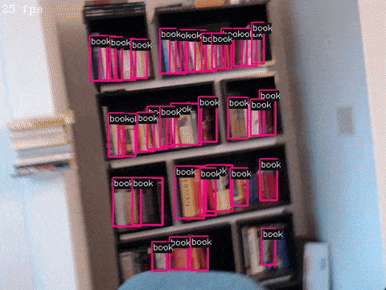

[](https://travis-ci.com/nrsyed/pytorch-yolov3)

This package is a from-scratch implementation of YOLOv3 in PyTorch capable of
running in real time on webcam streams as well as on image files and video
files. It parses the original Darknet configuration and weights files to build
the network and has been tested with the yolov3, yolov3-tiny, and yolov3-spp
models.

<br><br>
[Link to webcam demo on YouTube](https://www.youtube.com/watch?v=wyKoi5Hc8WY)

## Requirements

+ Python &ge; 3.6

## Installation

Clone the repo, install the package, and download weight files to the `models`
directory:

```
git clone https://github.com/nrsyed/pytorch-yolov3.git
cd pytorch-yolov3
pip install .
./get_weights.sh
```

## Examples

Refer to the [Usage](#usage) section for a complete list of options, or run
`yolov3 --help`. See the [doc/img](doc/img) directory for example image and
webcam video output.

```
# Run yolov3 on a webcam stream in real time (using the GPU and CUDA)
yolov3 -C -c models/yolov3.cfg -w models/yolov3.weights -n models/coco.names
```

```
# Run yolov3-tiny on a webcam stream from webcam 2 (using the CPU instead
# of GPU) and display the FPS in real time
yolov3 -C 2 -c models/yolov3-tiny.cfg -w models/yolov3-tiny.weights \
  -n models/coco.names -d cpu --show-fps
```

```
# Run yolov3-spp on a directory of images using the computer's 2nd GPU and
# only display objects with a probability score >0.15
yolov3 -I sample_dataset/images -c models/yolov3-spp.cfg \
  -w models/yolov3-spp.weights -n models/coco.names -d cuda:1 -p 0.15
```

```
# Run yolov3 on a video file and write the resulting video (with bboxes) to
# a new file.
yolov3 -V /path/to/video.mpeg -c models/yolov3.cfg -w models/yolov3.weights \
  -n models/coco.names -o /path/to/output.mp4
```

## Usage

### Required arguments

One of the following input source arguments is required:

+ `-C`/`--cam` `[cam_id]`: Webcam device ID or path to video stream
	(e.g., RTSP URL); defaults to `0` if none provided.
+ `-I`/`--image` `<path>`: Path to an image file or directory of images.
+ `-V`/`--video` `<path>`: Path to a video file.

The following arguments are always required:

+ `-c`/`--config` `<path>`: Path to Darknet model .cfg file.
+ `-w`/`--weights` `<path>`: Path to Darknet model .weights file.

### Optional arguments

+ `-d`/`--device` `<device>`: Device on which to load the model (e.g., `cpu`,
	`cuda`, `cuda:1`)
+ `-h`/`--help`: Display help message.
+ `-i`/`--iou-thresh` `<iou>`: Non-maximum suppression IOU threshold.
+ `-n`/`--class-names` `<path>`: Path to text file of class names containing
	one class name per line. If omitted, the class index is displayed on
	the resulting image instead of the class name.
+ `-p`/`--prob-thresh` `<prob>`: Detection probability threshold; predictions
	with a computed probability below this threshold are ignored.
+ `-o`/`--output` `<path>`: Path for output video file (use with `--cam` or
  `--video` input source options). Only .mp4 filetype supported. For `--cam`,
  the output video framerate (FPS) is equal to the average framerate over the
  duration of the recording. For `--video`, the output video framerate is equal
  to the input file framerate.
+ `--show-fps`: Display frames processed per second (`--cam` input only).


## Acknowledgments
The model config files in the `models` directory were obtained from
https://github.com/pjreddie/darknet/tree/master/cfg. The list of COCO class
names in the `models` directory was obtained from
https://github.com/pjreddie/darknet/tree/master/data and modified to match
the COCO annotation category names. Weights for yolov3, yolov3-tiny, and
yolov3-spp can be found on Joseph Redmon's website at
https://pjreddie.com/darknet/yolo/. Sample images were taken from the original
COCO dataset (http://cocodataset.org); the functions in the `yolov3.devtools`
module were used to select images containing at least 6 classes of objects
belonging to at least 6 distinct supercategories and no more than 10 objects
(from the 2017 validation images dataset).
